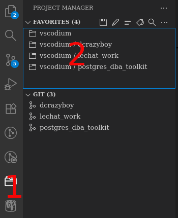

# 🐱 Boîte à Outils VSCodium pour Le Matou

Ce dépôt contient une configuration **hybride** pour VSCodium, optimisée pour :
- **Travailler sur plusieurs projets Git** en isolation.
- **Basculer facilement** entre un contexte global et des workspaces dédiés.
- **Partager des fichiers** entre projets (ex: SQL, scripts, docs).

---

## 📂 Structure des Dossiers
```
prof
  └──  vscodium
        ├── dcrazyboy/          # 🔒 Projet privé (GitHub privé)
        ├── lechat_work/        # 🤝 Projet collaboratif (GitHub privé/public)
        ├── postgres_dba_toolkit/ # 🌍 Projet public (GitHub public)
        ├── README.md           # Ce fichier
        ├── dcrazyboy.code-workspace
        ├── lechat_work.code-workspace
        └── postgres_dba_toolkit.code-workspace
```

---

## 🛠 Extensions Communes
Toutes les configurations incluent ces extensions de base :
- **:emojisense:** : Pour ajouter des icones sympas dans les markdown (au moin ici)
- **GitLens** : Superpouvoirs Git (historique, blame, etc.).
- **macros** : permet de rajoute des macro a Codium
- **Markdown All in One** : Édition avancée de Markdown.
- **Project MAnager** : Basculer entre les workspaces en 1 clic.
- **ShellCheck** : Vérification des scripts shell.

---

## 🚀 Comment bascule d'un projet à un autre ?



1. Dans la side bar, choisit Project Manager
2. Dans les favoris choisir le projet global (vscodium) ou le sous-projet que l'on veux utilliser 

---

## 🎯 Raccourcis Clavier Utiles
| Action                           | Raccourci    |
| :------------------------------- | :----------- |


*(Les raccourcis sont configurés dans `keybindings.json`.)*

---

## 📌 Notes
- Les **emojis Markdown** sont disponibles dans `emojis.md`.
- Les **paramètres communs** sont dans `settings.json` (partagés entre tous les workspaces).
- Pour ajouter des **extensions spécifiques** à un projet, édite son fichier `.code-workspace`.
